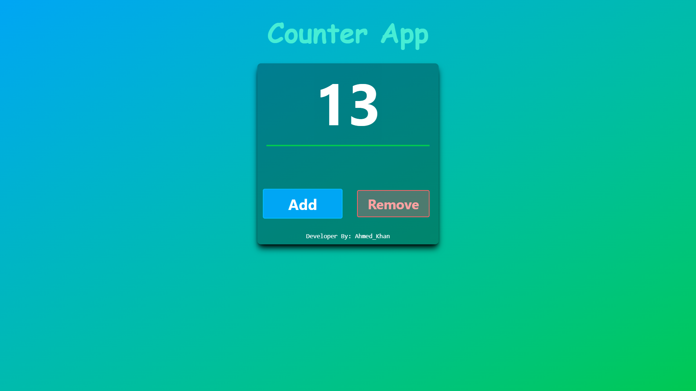

# React + Vite

This template provides a minimal setup to get React working in Vite with HMR and some ESLint rules.

  <!-- Screenshot ke liye image add kiya gaya hai -->

## Installation

1. Clone this project:
   ```bash
   git clone <repository-url>
   ```
2. Navigate to the directory:
   ```bash
   cd Counter
   ```
3. Install dependencies:
   ```bash
   npm install
   ```

## Usage

To start the project:
